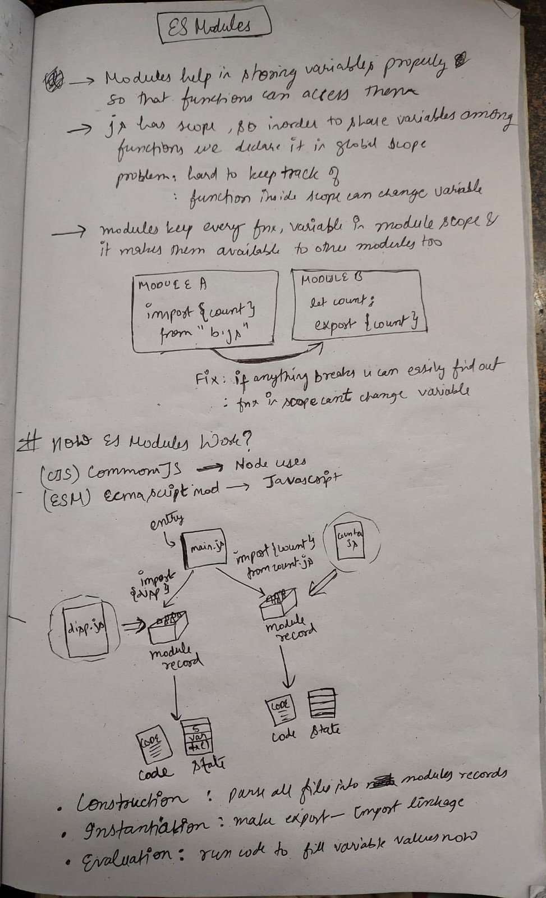

# Monday, September 01 2025

## Tasks

## Notes

HuggingFaceAPI

1. for hugging face to work in vanillaJS:
->get api key 
->add script file as  
->import {InferenceClient} from "http/cdn/@huggingface/inference"
->create a global variable for api token
->go to https://huggingface.co/models and choose a model
->pick deploy -> inference providers -> choose JS fetch
or just use fetch for url https://router.huggingface.co/v1/chat/completions
model: openai/gpt-oss-120b:together

2. in JS import statements arent picking anythng from node_modules and giving syntax error
3. What is ES modules? How it works?

4. Logic of program:

-> first we take input and append it to list (addbtn event listener)  
    -> now program appends all the items to a string
    -> when model is called (btn.addEventListener())then async fnx waits for fetch result
    -> till then we assign allitems = getItems();
    -> after getting response, we send the query() containing msg `in 120 words make a recipie from ${allitems}` to model
    ->render the response to 

